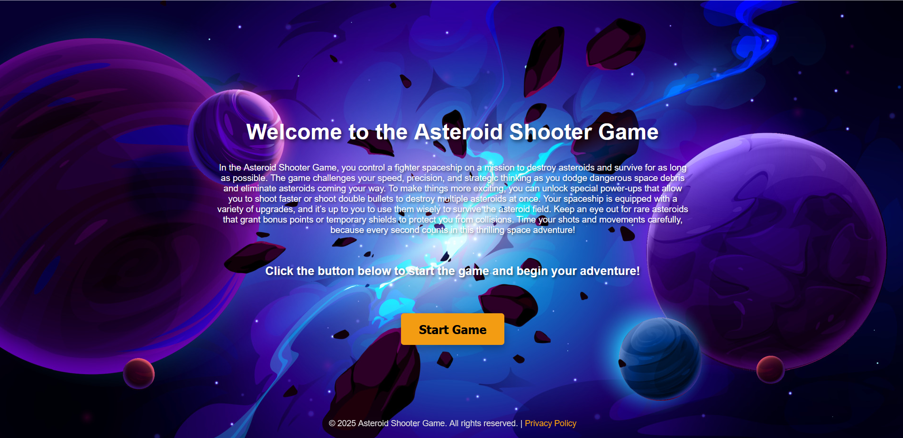
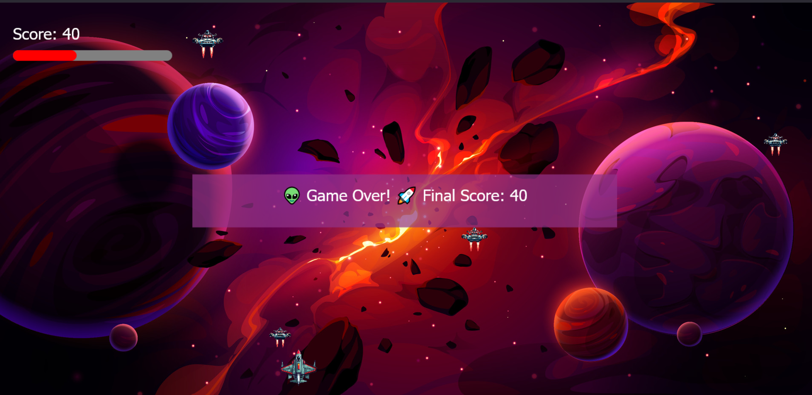

# 🚀 Asteroid Shooter Game

## 📌 Overview
**Asteroid Shooter** is a fast-paced, browser-based arcade game built entirely with **HTML**, **CSS**, and **vanilla JavaScript**.  
Players control a spaceship to shoot down incoming asteroids while skillfully avoiding collisions.  
With responsive controls, smooth animations, and sound effects, the game offers a fun and challenging experience right in the browser.

---

## 🚀 Key Features

- 🎮 **Fully Browser-Based**  
  Developed using pure HTML, CSS, and JavaScript — no external game engines.

- 🛸 **Real-Time Spaceship Controls**  
  Smooth movement, responsive shooting mechanics, and real-time action.

- ☄️ **Dynamic Asteroid Generation**  
  Randomly spawning asteroids and accurate collision detection.

- 🏆 **Score Tracking**  
  Keep track of your points and challenge yourself to beat your high score.

- 📱 **Responsive Design**  
  Optimized for desktop and mobile browsers.

- 🎧 **Immersive Experience**  
  Smooth animations and sound effects for engaging gameplay.

---

## 💻 Technologies Used

- **HTML5 Canvas** → for game rendering  
- **CSS3** → for layout and design  
- **Vanilla JavaScript** → for all game logic, mechanics, and interactions

---

## 🖼️ Screenshots

### 🚀 Start Screen

### ☄️ In-Game Action

---

## 📥 Run the Game

